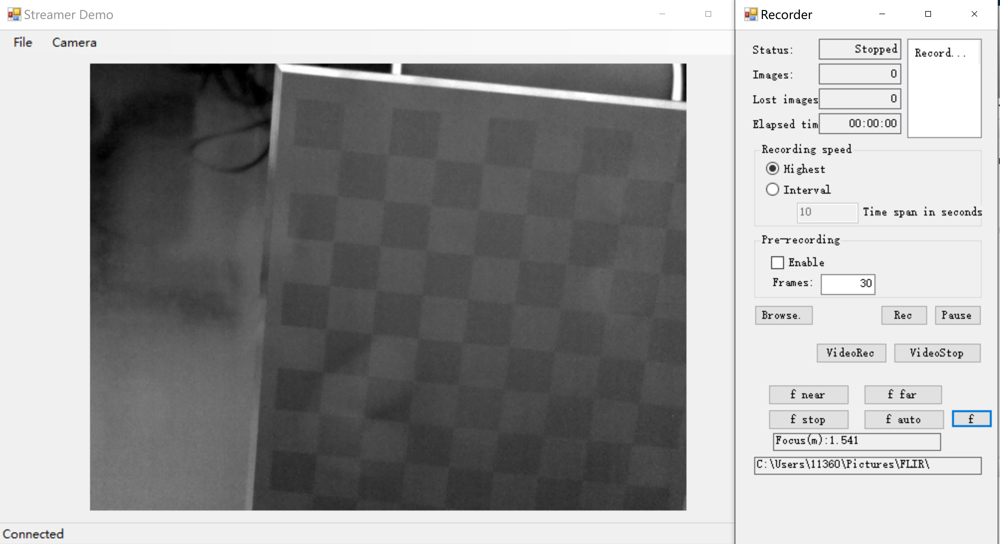

# FLIR A615 控制

## 一、介绍

利用FLIR提供的ATLAS .NET SDK，在FLIR官方提供的demo基础上修改FLIR A615控制客户端，可以进行相机连接、采图、自动对焦等操作。

在记录获得.seq文件后，通过loadDatafromJpg.m的Matlab文件可以将.seq文件转化为FLIR A615相机原始文件。

## 二、依赖与环境

* 依赖：

  1. [FLIR .NET ATLAS SDK](https://www.flir.cn/products/flir-atlas-sdk-for-.net/)

  2. [FLIR ATLAS FOR MATLAB](https://www.flir.com/support/products/flir-atlas-sdk-for-matlab/?page=1)(这个好像官方不再支持了，如果需要安装包的话可以联系作者)

* 环境

   windows10 + MATLAB + Visual Studio

## 三、界面

